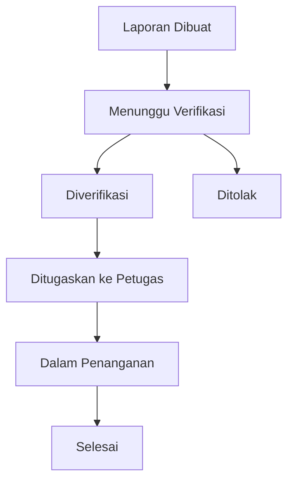
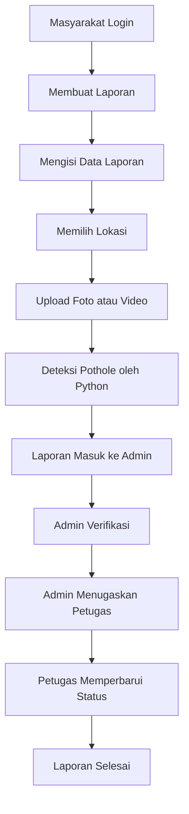

# Gambaran Sistem Web SILAJAK

## 1. Ringkasan Sistem

SILAJAK adalah sistem web untuk pelaporan, verifikasi, dan pemantauan penanganan jalan rusak. Sistem ini digunakan oleh masyarakat untuk membuat laporan kerusakan jalan, oleh admin untuk memverifikasi laporan, dan oleh petugas lapangan untuk memperbarui status penanganan.

Sebagian backend sistem akan menggunakan program Python deteksi pothole yang sudah dibuat sebelumnya. Program tersebut akan digunakan untuk memproses foto atau video yang diunggah pengguna, lalu menghasilkan informasi pendukung seperti ada atau tidaknya indikasi lubang jalan, tingkat keyakinan deteksi, dan status kerusakan.

## 2. Tujuan Sistem

- Memudahkan masyarakat melaporkan jalan rusak secara digital.
- Membantu admin memverifikasi laporan dengan dukungan deteksi pothole otomatis.
- Memudahkan penugasan petugas lapangan.
- Menyediakan riwayat laporan dan status penanganan secara transparan.
- Menyediakan dashboard dan rekap data laporan untuk kebutuhan monitoring.

## 3. Jenis Pengguna

### 3.1 Masyarakat

Masyarakat adalah pengguna umum yang dapat membuat akun, login, membuat laporan jalan rusak, memilih lokasi kerusakan, mengunggah foto atau video, melihat status laporan, dan melihat riwayat laporan.

### 3.2 Admin

Admin adalah pengguna yang bertugas mengelola data laporan, melihat hasil deteksi pothole, memverifikasi laporan, menentukan status laporan, menugaskan petugas lapangan, serta melihat dashboard dan rekap data.

### 3.3 Petugas Lapangan

Petugas lapangan adalah pengguna yang menerima tugas penanganan laporan, melihat detail lokasi dan laporan, kemudian memperbarui status penanganan di lapangan.

## 4. Manajemen Akun dan Hak Akses

### 4.1 Registrasi Akun Pengguna

Sistem menyediakan fitur registrasi akun untuk masyarakat. Data yang dapat diisi antara lain:

- Nama lengkap
- Email
- Nomor telepon
- Password
- Konfirmasi password

Setelah registrasi berhasil, pengguna dapat login ke sistem sebagai masyarakat.

### 4.2 Login Pengguna

Sistem menyediakan fitur login untuk semua jenis pengguna. Pengguna memasukkan email dan password. Setelah berhasil login, sistem mengarahkan pengguna ke halaman sesuai role masing-masing.

Contoh pengalihan halaman:

- Masyarakat masuk ke halaman dashboard masyarakat.
- Admin masuk ke dashboard admin.
- Petugas lapangan masuk ke halaman daftar tugas.

### 4.3 Manajemen Hak Akses

Sistem menggunakan role untuk membatasi akses fitur.

| Role | Hak Akses Utama |
| --- | --- |
| Masyarakat | Membuat laporan, upload media, melihat status, melihat riwayat |
| Admin | Verifikasi laporan, manajemen laporan, penugasan petugas, dashboard, rekap |
| Petugas | Melihat tugas, memperbarui status penanganan |

## 5. Fitur Utama Sistem

### 5.1 Membuat Laporan Jalan Rusak

Masyarakat dapat membuat laporan jalan rusak melalui formulir laporan. Data yang diisi meliputi:

- Judul laporan
- Deskripsi kerusakan
- Alamat atau nama ruas jalan
- Lokasi kerusakan
- Foto atau video jalan rusak
- Keterangan tambahan

Setelah laporan dikirim, laporan akan masuk ke sistem dengan status awal **Menunggu Verifikasi**.

### 5.2 Memilih Lokasi Kerusakan Jalan

Pengguna dapat memilih lokasi kerusakan jalan melalui input alamat atau titik lokasi pada peta.

Data lokasi yang dapat disimpan:

- Alamat lengkap
- Nama ruas jalan
- Kecamatan atau kelurahan
- Latitude
- Longitude

Fitur peta dapat dibuat menggunakan layanan seperti Leaflet, OpenStreetMap, atau Google Maps API.

### 5.3 Mengunggah Foto atau Video Jalan Rusak

Pengguna dapat mengunggah media pendukung berupa foto atau video. Media ini akan disimpan di server dan digunakan untuk proses deteksi pothole.

Format media yang disarankan:

- Foto: JPG, JPEG, PNG
- Video: MP4, MOV, AVI

Batas ukuran file dapat ditentukan pada tahap implementasi, misalnya maksimal 10 MB untuk foto dan 100 MB untuk video.

### 5.4 Deteksi Jalan Berlubang

Sistem menyediakan fitur deteksi jalan berlubang menggunakan backend Python deteksi pothole.

Alur deteksi:

1. Pengguna mengunggah foto atau video.
2. Backend web menyimpan media.
3. Backend web mengirim media ke modul Python deteksi pothole.
4. Modul Python memproses media.
5. Sistem menyimpan hasil deteksi.
6. Admin melihat hasil deteksi sebagai informasi pendukung saat verifikasi.

Informasi hasil deteksi yang dapat ditampilkan:

- Status deteksi: terdeteksi lubang atau tidak terdeteksi
- Jumlah lubang terdeteksi
- Tingkat keyakinan deteksi
- Gambar atau video hasil deteksi dengan bounding box jika tersedia
- Status kerusakan, misalnya ringan, sedang, atau berat

Catatan: hasil deteksi otomatis tidak langsung menentukan kebenaran laporan. Admin tetap melakukan verifikasi akhir.

### 5.5 Melihat Status Laporan

Masyarakat dapat melihat perkembangan status laporan yang sudah dikirim.

Contoh status laporan:

- Menunggu Verifikasi
- Diverifikasi
- Ditolak
- Ditugaskan ke Petugas
- Dalam Penanganan
- Selesai

### 5.6 Verifikasi Laporan oleh Admin

Admin dapat membuka detail laporan, melihat data pelapor, lokasi, media yang diunggah, dan hasil deteksi pothole.

Admin dapat melakukan tindakan:

- Menyetujui laporan
- Menolak laporan
- Memberi catatan verifikasi
- Mengubah tingkat kerusakan
- Meneruskan laporan untuk penugasan petugas

### 5.7 Manajemen Data Laporan

Admin dapat mengelola seluruh laporan yang masuk. Fitur manajemen data laporan meliputi:

- Melihat daftar laporan
- Mencari laporan berdasarkan kata kunci
- Memfilter laporan berdasarkan status
- Memfilter laporan berdasarkan tanggal
- Melihat detail laporan
- Mengubah status laporan
- Menghapus atau mengarsipkan laporan jika diperlukan

### 5.8 Penugasan Petugas Lapangan

Admin dapat menugaskan laporan yang sudah diverifikasi kepada petugas lapangan.

Data penugasan meliputi:

- Laporan yang ditangani
- Nama petugas
- Tanggal penugasan
- Catatan tugas
- Prioritas penanganan

Setelah ditugaskan, status laporan dapat berubah menjadi **Ditugaskan ke Petugas**.

### 5.9 Pembaruan Status Penanganan

Petugas lapangan dapat memperbarui status penanganan laporan.

Contoh pembaruan:

- Petugas menerima tugas
- Petugas menuju lokasi
- Penanganan sedang dilakukan
- Penanganan selesai
- Kendala di lapangan

Petugas juga dapat menambahkan catatan dan foto bukti penanganan.

### 5.10 Melihat Riwayat Laporan

Masyarakat dapat melihat riwayat laporan yang pernah dibuat.

Data yang ditampilkan:

- Judul laporan
- Tanggal laporan
- Lokasi
- Status terakhir
- Ringkasan hasil verifikasi

### 5.11 Dashboard Admin

Dashboard admin menampilkan ringkasan kondisi laporan.

Contoh informasi dashboard:

- Total laporan masuk
- Total laporan menunggu verifikasi
- Total laporan diverifikasi
- Total laporan ditolak
- Total laporan dalam penanganan
- Total laporan selesai
- Grafik laporan berdasarkan bulan
- Grafik laporan berdasarkan tingkat kerusakan
- Peta sebaran lokasi laporan

### 5.12 Rekap dan Laporan Data

Admin dapat melihat dan mengunduh rekap data laporan.

Rekap dapat difilter berdasarkan:

- Rentang tanggal
- Status laporan
- Tingkat kerusakan
- Wilayah
- Petugas

Format ekspor yang dapat disediakan:

- PDF
- Excel
- CSV

## 6. Alur Status Laporan



## 7. Alur Proses Laporan



## 8. Rancangan Modul Sistem

### 8.1 Modul Auth

Modul ini menangani registrasi, login, logout, validasi password, session, token, dan pembatasan akses berdasarkan role.

### 8.2 Modul Laporan

Modul ini menangani pembuatan laporan, penyimpanan data laporan, status laporan, riwayat laporan, dan detail laporan.

### 8.3 Modul Lokasi

Modul ini menangani data lokasi, koordinat peta, alamat, dan visualisasi titik laporan.

### 8.4 Modul Media

Modul ini menangani upload foto atau video, validasi format file, penyimpanan file, dan pengambilan media untuk ditampilkan.

### 8.5 Modul Deteksi Pothole

Modul ini menjadi penghubung antara backend web dan program Python deteksi pothole.

Kemungkinan pendekatan integrasi:

- Backend web memanggil script Python secara langsung.
- Backend web menyediakan API internal ke service Python.
- Python deteksi pothole dijalankan sebagai microservice menggunakan Flask atau FastAPI.

Rekomendasi awal: gunakan FastAPI atau Flask untuk membungkus model deteksi pothole sebagai service agar lebih mudah dihubungkan ke backend web.

### 8.6 Modul Verifikasi Admin

Modul ini menangani proses admin dalam memeriksa laporan, melihat hasil deteksi, memberi catatan, menyetujui, atau menolak laporan.

### 8.7 Modul Penugasan

Modul ini menangani proses admin dalam memilih petugas dan memberikan tugas penanganan laporan.

### 8.8 Modul Status Penanganan

Modul ini menangani pembaruan status oleh petugas lapangan, catatan penanganan, dan bukti foto setelah perbaikan.

### 8.9 Modul Dashboard dan Rekap

Modul ini menangani statistik laporan, grafik, peta sebaran, dan ekspor data.

## 9. Rancangan Database Awal

### 9.1 Tabel users

| Field | Keterangan |
| --- | --- |
| id | ID pengguna |
| name | Nama lengkap |
| email | Email pengguna |
| phone | Nomor telepon |
| password | Password terenkripsi |
| role | masyarakat, admin, atau petugas |
| created_at | Tanggal akun dibuat |
| updated_at | Tanggal akun diperbarui |

### 9.2 Tabel reports

| Field | Keterangan |
| --- | --- |
| id | ID laporan |
| user_id | ID pelapor |
| title | Judul laporan |
| description | Deskripsi kerusakan |
| road_name | Nama ruas jalan |
| address | Alamat lengkap |
| latitude | Koordinat latitude |
| longitude | Koordinat longitude |
| additional_note | Keterangan tambahan |
| status | Status laporan |
| damage_level | Tingkat kerusakan |
| verification_note | Catatan admin |
| created_at | Tanggal laporan dibuat |
| updated_at | Tanggal laporan diperbarui |

### 9.3 Tabel report_media

| Field | Keterangan |
| --- | --- |
| id | ID media |
| report_id | ID laporan |
| file_path | Lokasi file |
| file_type | image atau video |
| original_name | Nama file asli |
| created_at | Tanggal upload |

### 9.4 Tabel pothole_detections

| Field | Keterangan |
| --- | --- |
| id | ID hasil deteksi |
| report_id | ID laporan |
| media_id | ID media |
| detected | Ada lubang atau tidak |
| pothole_count | Jumlah lubang terdeteksi |
| confidence | Tingkat keyakinan |
| result_file_path | File hasil deteksi |
| damage_status | Status kerusakan |
| raw_result | Hasil mentah dari model jika diperlukan |
| created_at | Tanggal deteksi |

### 9.5 Tabel assignments

| Field | Keterangan |
| --- | --- |
| id | ID penugasan |
| report_id | ID laporan |
| officer_id | ID petugas |
| assigned_by | ID admin |
| priority | Prioritas tugas |
| task_note | Catatan tugas |
| assigned_at | Tanggal penugasan |

### 9.6 Tabel handling_updates

| Field | Keterangan |
| --- | --- |
| id | ID pembaruan |
| report_id | ID laporan |
| officer_id | ID petugas |
| status | Status penanganan |
| note | Catatan petugas |
| proof_file_path | Foto bukti penanganan |
| created_at | Tanggal pembaruan |

## 10. Rancangan Halaman Web

### 10.1 Halaman Masyarakat

- Register
- Login
- Dashboard masyarakat
- Form buat laporan
- Pilih lokasi laporan
- Upload foto atau video
- Detail laporan
- Status laporan
- Riwayat laporan

### 10.2 Halaman Admin

- Login admin
- Dashboard admin
- Daftar semua laporan
- Detail laporan
- Verifikasi laporan
- Hasil deteksi pothole
- Manajemen data laporan
- Penugasan petugas
- Rekap dan ekspor laporan

### 10.3 Halaman Petugas

- Login petugas
- Daftar tugas
- Detail tugas
- Update status penanganan
- Upload bukti penanganan

## 11. Rekomendasi Teknologi

Pilihan teknologi dapat disesuaikan dengan kebutuhan dan kemampuan tim.

### 11.1 Frontend

- HTML, CSS, JavaScript
- Bootstrap atau Tailwind CSS
- React jika ingin frontend lebih modern dan terpisah

### 11.2 Backend Web

Beberapa pilihan:

- Laravel
- Node.js Express
- Python Django
- Python Flask
- Python FastAPI

Jika backend deteksi pothole sudah menggunakan Python, opsi yang sederhana adalah menggunakan Flask, FastAPI, atau Django agar integrasi deteksi lebih mudah.

### 11.3 Database

- MySQL
- PostgreSQL
- SQLite untuk tahap prototipe awal

### 11.4 Deteksi Pothole

- Python
- OpenCV
- Model deteksi pothole yang sudah dibuat
- Flask atau FastAPI sebagai API deteksi

## 12. Contoh Struktur Folder Jika Menggunakan Python FastAPI

```text
silajak/
├── backend/
│   ├── app/
│   │   ├── main.py
│   │   ├── models/
│   │   ├── schemas/
│   │   ├── routes/
│   │   ├── services/
│   │   │   └── pothole_detection_service.py
│   │   ├── uploads/
│   │   └── utils/
│   ├── requirements.txt
│   └── .env
├── frontend/
│   ├── index.html
│   ├── css/
│   ├── js/
│   └── assets/
└── GAMBARAN_SISTEM_SILAJAK.md
```

## 13. Prioritas Pengembangan

### Tahap 1: Dasar Sistem

- Registrasi
- Login
- Role pengguna
- Form laporan
- Upload media
- Riwayat laporan
- Status laporan

### Tahap 2: Admin dan Verifikasi

- Dashboard admin
- Daftar laporan
- Detail laporan
- Verifikasi laporan
- Manajemen status laporan

### Tahap 3: Integrasi Deteksi Pothole

- Hubungkan upload media ke program Python
- Simpan hasil deteksi
- Tampilkan hasil deteksi ke admin
- Tentukan status kerusakan otomatis sebagai saran

### Tahap 4: Petugas Lapangan

- Manajemen petugas
- Penugasan laporan
- Update status penanganan
- Upload bukti penanganan

### Tahap 5: Rekap dan Laporan

- Filter data laporan
- Grafik dashboard
- Export PDF, Excel, atau CSV
- Peta sebaran laporan

## 14. Catatan Pengembangan Awal

- Password pengguna harus disimpan dalam bentuk hash, bukan teks biasa.
- Upload file perlu divalidasi agar aman.
- Hasil deteksi pothole digunakan sebagai pendukung, bukan keputusan final.
- Admin tetap menjadi pihak yang memverifikasi kebenaran laporan.
- Data lokasi sebaiknya disimpan dalam bentuk alamat dan koordinat.
- Setiap perubahan status laporan sebaiknya memiliki catatan waktu.

## 15. Kesimpulan

SILAJAK dapat dibangun sebagai sistem pelaporan jalan rusak berbasis web dengan integrasi deteksi pothole menggunakan Python. Sistem ini memiliki tiga aktor utama, yaitu masyarakat, admin, dan petugas lapangan. Alur utama dimulai dari masyarakat membuat laporan, sistem melakukan deteksi pothole, admin melakukan verifikasi, petugas menangani laporan, lalu masyarakat dapat memantau status hingga laporan selesai.
